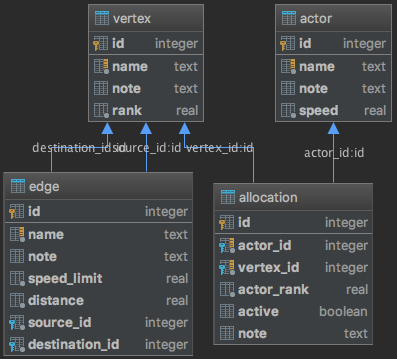

Information system of graph, actors, allocations of actors on the graph, generates an optimal allocation, 
evaluates its metrics, finds shortest path for an actor from one vertex to another

### Functions
* generate an optimal allocation of actors on the graph
* evaluate metrics of the allocation
* find shortest path for an actor from one vertex to another
* extract all, by id, create, update, delete by id actors, vertices, edges, allocations

### Database
  
[SQLite database schema](src/main/resources/schema.sql) 

### Technologies and tools
* Java 8
* Spring framework (Boot, Web/MVC, Test, Data)
* SQLite
* Apache log4j
* Maven
* Git
* IntelliJ IDEA
* Insomnia REST Client
* Java Visual VM (profiler)